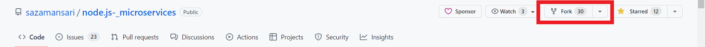
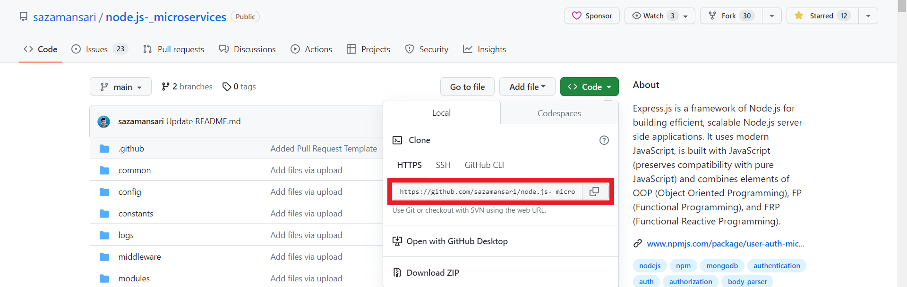

# Contributing to User-Auth-Microservice

Thank you for considering contributing to User-Auth-Microservice! We appreciate your interest in improving the project and welcome your contributions. By contributing, you can help us make the microservice better and more secure. Please take a moment to review the guidelines below to ensure a smooth contribution process.

# How to **contribute**?

_If you're not comfortable with command line, [here are tutorials using GUI tools.](#tutorials-using-other-tools)_
_If you don't have git on your machine, [install it](https://help.github.com/articles/set-up-git/)._

**1.** Fork [this](https://github.com/sazamansari/node.js-_microservices) repository.



<br>

**2.** Clone your forked copy of the project.



<br>

```
git clone https://github.com/<your_github_username>/node.js-_microservices.git
```

**3.** Navigate to the project directory :file_folder: .

```
cd node.js-_microservices
```

**4.** Add a reference(remote) to the original repository.

```
git remote add upstream https://github.com/sazamansari/node.js-_microservices.git
```

**5.** Check the remotes for this repository.

```
git remote -v
```

**6.** Always take a pull from the upstream repository to your master branch to keep it at par with the main project(updated repository).

```
git pull upstream main
```

**7.** Create a new branch.

```
git checkout -b <your_branch_name>
```

**8.** Perform your desired changes to the code base.

**9.** Track your changes:heavy_check_mark: .

```
git add .
```

**10.** Commit your changes .

```
git commit -m "Your message"
```

**11.** Push the committed changes in your feature branch to your remote repo.

```
git push -u origin <your_branch_name>
```

**12.** To create a pull request, click on `compare and pull requests`. Please ensure you compare your feature branch to the desired branch of the repository you are supposed to make a PR to.

**13.** Add appropriate title and description to your pull request explaining your changes and efforts done.

**14.** Click on `Create Pull Request`.

**15.** Congratulations! You have made a succsessful PR to the node.js-\_microservices.

<br>

**16.** Now sit back patiently and relax while your PR is being reviewed.

#### Note :-

- **Please follow best code formatting and linting practices to assure good code quality. You should use tools such as Prettier or Eslint for the purpose.**

<hr>

### Show some ❤ by starring ⭐ the <a style="text-decoration:none" href="https://github.com/aniketsinha2002/DataScienceWebsite.github.io" target="_blank">repository.</a>
